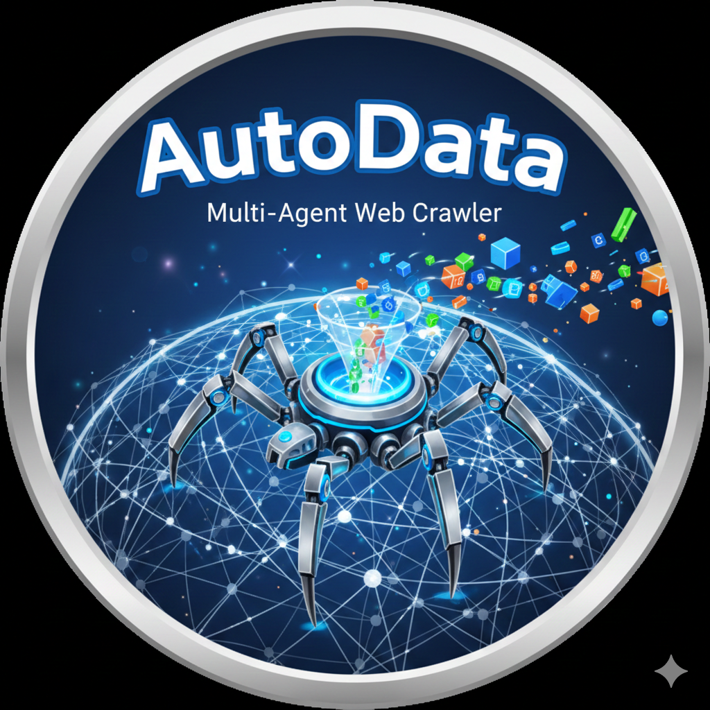
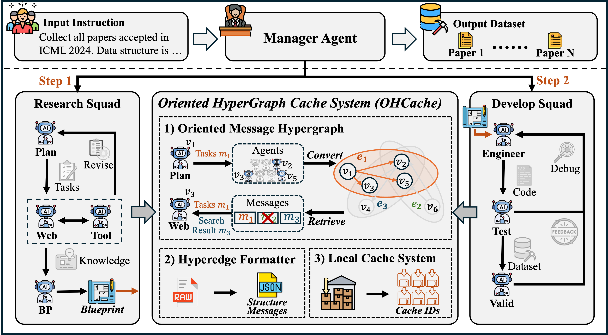

  # AutoData: A Multi-Agent System for Open Web Data Collection

<div align="center">
  
  

  [](https://neurips.cc/)
  [](./LICENSE)
  [](https://www.python.org/)
  [](https://github.com/psf/black)

  [**Read the Paper**](https://arxiv.org/abs/2505.15859) | [**Documentation**](https://autodata-doc.readthedocs.io/en/latest/) | [**Contributing**](./CONTRIBUTING.md)

</div>

> **Version 0.1.0 (Beta).** AutoData is currently in beta; expect rapid iteration and occasional breaking changes while we harden the multi-agent orchestration stack.

---

## 📖 Introduction

**AutoData (v0.1.0 Beta)** is a pioneering multi-agent system designed to revolutionize data collection from the open web. Accepted at **NeurIPS 2025**, AutoData automates the generation of crawlers and the extraction of data from diverse online sources, addressing the complexities of modern web environments.

Traditional web scraping often requires manual script maintenance and struggles with dynamic content. AutoData overcomes these challenges by employing a sophisticated **Supervisor-Squad** architecture, where specialized agents collaborate to plan, navigate, and extract data efficiently.

### Key Features

-   **🤖 Multi-Agent Architecture**: Orchestrated by a Supervisor Agent managing specialized Research and Development squads.
-   **🧠 OHCache (Oriented Message Hypergraph)**: A novel context management system that optimizes information flow between agents, reducing token usage and noise.
-   **🌐 Open Web Adaptability**: Capable of handling complex, dynamic websites using browser automation and intelligent observation.
-   **🛠️ Automated Blueprinting**: Synthesizes research findings into executable Python crawling code.

---

## 🏗️ Framework

The core of AutoData lies in its hierarchical agent design and the OHCache mechanism.

<div align="center">
  
</div>

### Agent Hierarchy

1.  **Supervisor Agent**: The central coordinator that manages workflow and hand-offs.
2.  **Research Squad**:
    -   **Plan Agent**: Formulates high-level strategies.
    -   **Tool Agent**: Manages tool utilization.
    -   **Browser Agent**: Navigates and observes the web.
    -   **Blueprint Agent**: Creates development blueprints from findings.
3.  **Development Squad**:
    -   **Engineer Agent**: Implements the crawling logic.
    -   **Test Agent**: Validates the code against target sites.
    -   **Validate Agent**: Ensures data quality and correctness.

---

## 🚀 Getting Started

### Prerequisites

-   **Python 3.11+**
-   **uv** (for dependency management)

### Installation

1.  **Clone the repository:**
    ```bash
    git clone https://github.com/Tianyi-Billy-Ma/AutoData.git
    cd AutoData
    ```

2.  **Install dependencies and environment:**
    ```bash
    uv sync
    ```

3.  **Install browser binaries:**
    ```bash
    playwright install
    playwright install-deps
    ```

---

## ⚙️ Configuration

AutoData uses a flexible configuration system. You can set up your environment variables and YAML configs as follows.

### LLM Provider Setup

Set your API keys in your environment:

```bash
# Standard Providers
export OPENAI_API_KEY="your-openai-key"
export ANTHROPIC_API_KEY="your-anthropic-key"
export GOOGLE_API_KEY="your-google-key"

# OR for OpenRouter
export OPENROUTER_API_KEY="your-openrouter-key"
export OPENROUTER_BASE_URL="https://openrouter.ai/api/v1"
```

> Prefer saving keys once in a `.env` file (`cp .env.example .env`) instead of exporting them in every terminal. AutoData automatically loads `.env`, `.env.local`, and `~/.autodata/.env` before parsing configs, so `uv run python -m autodata.main ...` always finds your credentials.

Configure your model in `configs/default.yaml`:

```yaml
llm_config:
  model: "gpt-4o"
  temperature: 0.0
```

---

## 🏃 Usage

To run a sample task using the default configuration:

```bash
uv run python -m autodata.main --config configs/default.yaml
```

### Inspecting Outputs

Results are saved in the `outputs/` directory:

```bash
ls outputs/default_run/
# ├── summary.json  (Metadata & Dataset reference)
# └── artifacts/...
```

---

## 🧭 Roadmap

- **Plugin ecosystem hardening:** finalize the third-party plugin spec (typed hooks, richer tool manifests) so integrators can ship domain packs without forking.
- **Automated evaluation harness:** release reproducible browser traces + artifact expectations to benchmark agent reasoning quality between versions.
- **Hosted orchestrator mode:** add multi-run scheduling, workspace quotas, and audit logs for teams that want to operate AutoData as a shared service.

---

## 🤝 Contributing

We welcome contributions! Please see our [CONTRIBUTING.md](./CONTRIBUTING.md) for guidelines on how to get involved.

### Development Tools

Ensure your code meets our standards before committing:

```bash
uv run ruff format
uv run ruff check .
uv run pytest
```

---

## 🖊️ Citation

If you use AutoData in your research, please cite our NeurIPS 2025 paper:

```bibtex
@inproceedings{autodata2025,
  title={AutoData: A Multi-Agent System for Open Web Data Collection},
  author={Ma, Tianyi and Qian, Yiyue and Zhang, Zheyuan and Wang, Zehong and Qian, Xiaoye and Bai, Feifan and Ding, Yifan and Luo, Xuwei and Zhang, Shinan and Murugesan, Keerthiram and others},
  booktitle={NeurIPS},
  year={2025},
}
```

---

<div align="center">
  <sub>Built with ❤️ by the AutoData Team.</sub>
</div>
